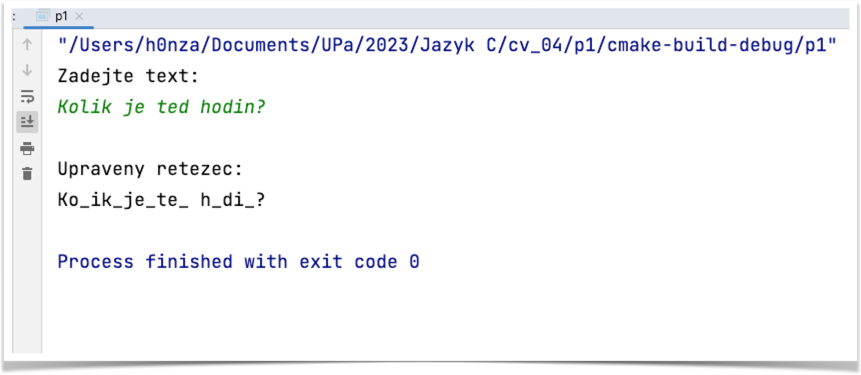

# Příklad 1
## Práce s řetězci

Napište program, který načte text ze standardního vstupu včetně mezer.

Maximální délka zpracovávaného textu bude omezena konstantou.

Zjistěte délku řetězce pomocí funkce z knihovny `<string.h>`.

V načteném textu nahraďte každý třetí znak podtržítkem.

Upravený text vypište na standardní výstup.

